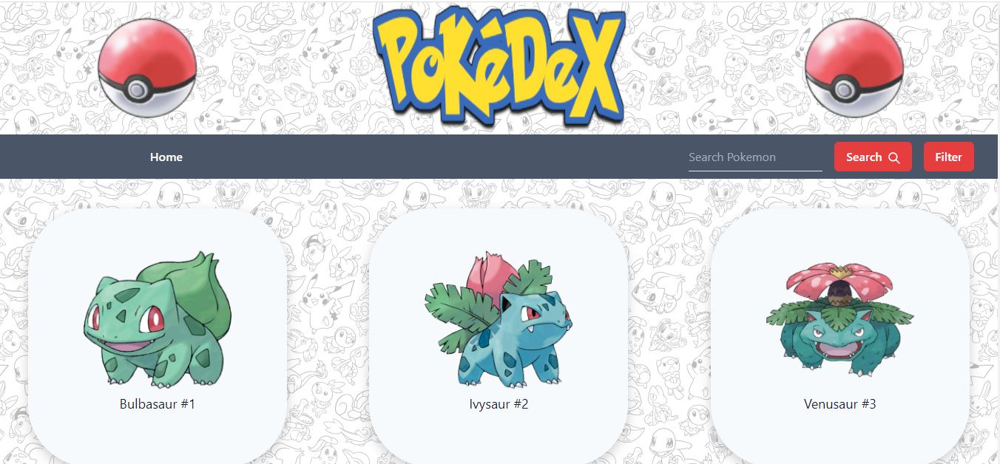
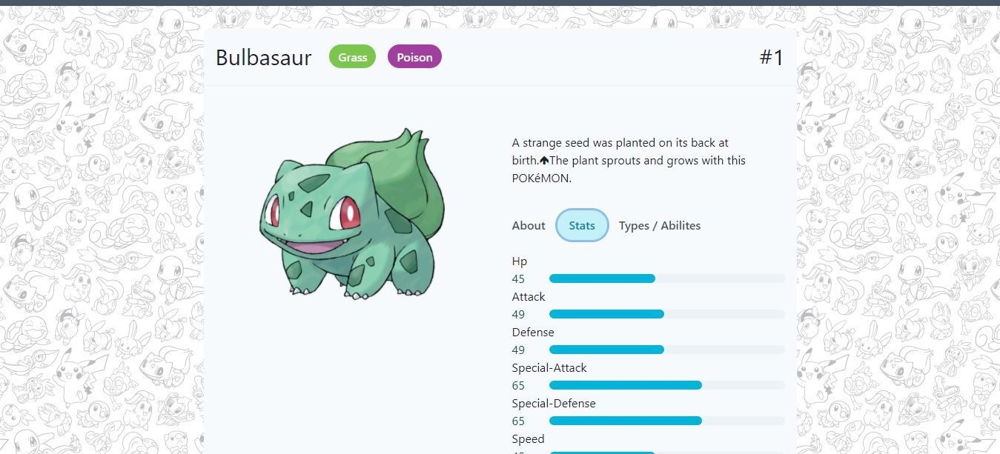

**Pokedex** is a project made with learning purposes.

[Demo](https://pokdexpokemon.netlify.app/)

## Getting started

```sh
git clone git@github.com:SauravBhandari93/Pokedex.git
cd Pokedex
npm install
npm start # open localhost:3000
```

## Screenshots





## Open API

Pokedex using the [PokeAPI](https://pokeapi.co/) for constructing RESTful API.<br>
PokeAPI provides a RESTful API interface to highly detailed objects built from thousands of lines of data related to Pokémon.
